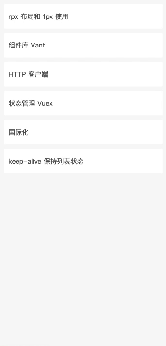

# html-skeleton-webpack-plugin

This is a plugin to help webpack inject skeleton element and CSS asset into html.

## Usage

**webpack.config.js**
```js
const HtmlSkeletonWebpackPlugin = require('html-skeleton-webpack-plugin');

module.exports = {
  entry: 'index.js',
  output: {
    path: __dirname + '/dist',
    filename: 'index_bundle.js'
  },
  plugins: [
    new HtmlWebpackPlugin(),
    new HtmlSkeletonWebpackPlugin({
      cssFilename: 'css/[name].[contenthash].css',
      template: path.resolve(__dirname, 'src/skeleton.vue'),
    }),
  ]
}
```

**index.html**
```html
<!DOCTYPE html>
<html>
  <head>
    <meta charset="utf-8">
    <title>Webpack App</title>
  </head>
  <body>
    <div id="app">
      <!-- inject-skeleton -->
    </div>
  </body>
</html>
```

This will inject skeleton element into *\<!-- inject-skeleton -->* and insert CSS assets into html head

## Options

|Name|Type|Default|Description|
|:--:|:--:|:-----:|:----------|
|**`cssFilename`**|`{String}`|`'sekeleton.[contenthash].css'`|The file to write the CSS asset to. Defaults to `sekeleton.[contenthash].css`.|
|**`template`**|`{String}`||relative or absolute path to the skeleton template. By default it will use the default loading template.|

## Preview

